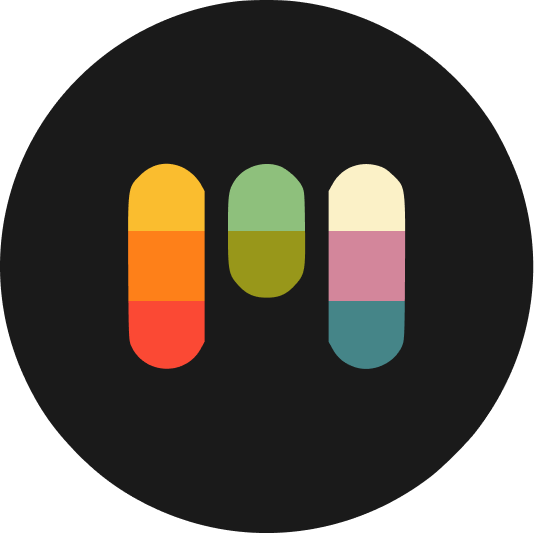
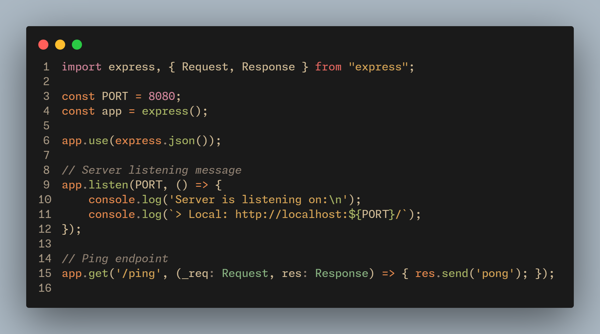
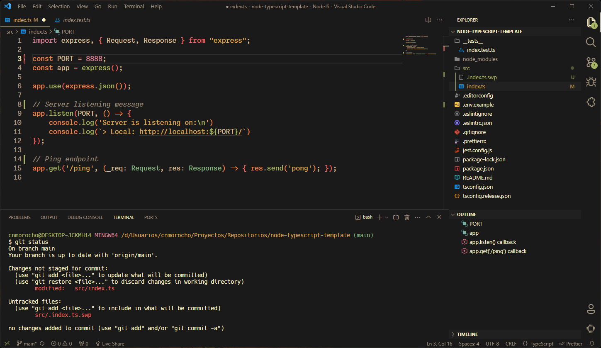

# Min Gruvbox Theme

A minimalistic and warm theme for VS Code that captures the colors of **[Material Gruvbox](https://github.com/sainnhe/gruvbox-material-vscode)** and the simplicity of **[Min Theme](https://github.com/miguelsolorio/min-theme)**.

**Code example** - Font: **[Monaspace Neon](https://github.com/githubnext/monaspace)**

**UI View** -  Font: **[Monaspace Neon](https://github.com/githubnext/monaspace)** - Icon: **[Bearded Icons](https://github.com/BeardedBear/bearded-icons)** - Product Icon: **[Symbols](https://github.com/miguelsolorio/vscode-symbols)**

## Installation
1. Go to **[VS Marketplace](https://marketplace.visualstudio.com/items?itemName=cnmorocho.min-gruvbox-theme)** or search for `cnmorocho.min-gruvbox-theme` in VS Code Extensions.
2. Click on the `Install` button.
3. Navigate to `File` > `Preferences` > `Theme` > `Color Theme` and select `Min Gruvbox`

## About Color Palette
> Designed as a bright theme with pastel **retro groove** colors. The main focus when developing gruvbox is to keep colors easily distinguishable, contrast enough and still pleasant for the eyes. - **[morhetz](https://github.com/morhetz/gruvbox)**

- **Background 0**:  `#2a2a2a`
- **Background 1**:  `#282828`
- **Foreground 0**:  `#fbf1c7`
- **Foreground 1**:  `#d4be98`
- **Gray**:  `#a89984`
- **Red**:  `#ea6962`
- **Orange**:  `#e78a4e`
- **Yellow**:  `#d8a657`
- **Green**:  `#a9b665`
- **Aqua**:  `#89b482`
- **Blue**:  `#7daea3`
- **Purple**:  `#d3869b`

## Credits
- The warm color palette from **[Material Gruvbox Theme](https://github.com/sainnhe/gruvbox-material-vscode)** by **[@sainnhe](https://github.com/sainnhe)**
- The clean and minimalistic design from **[Min Theme](https://github.com/miguelsolorio/min-theme)** by **[@miguelsolorio](https://github.com/miguelsolorio)**

