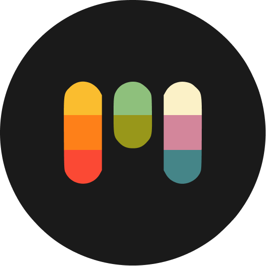
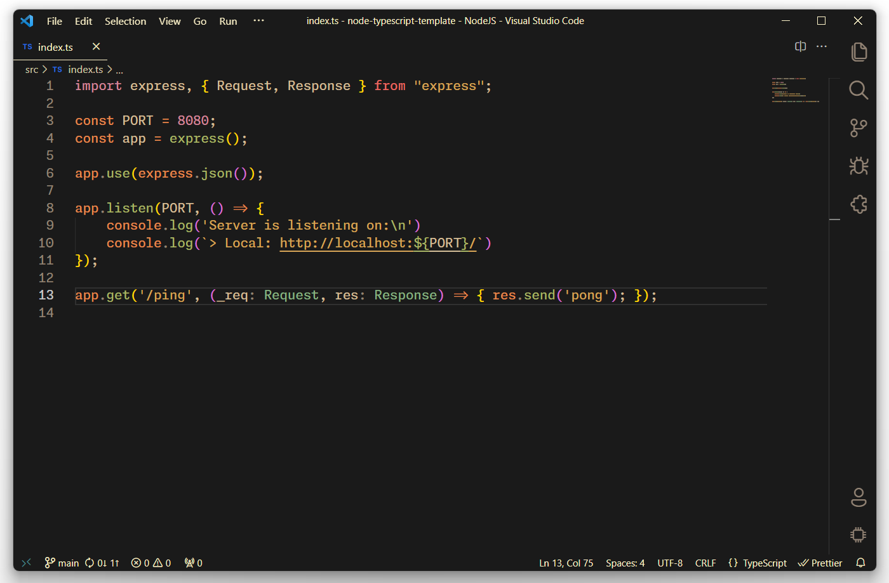

# Min Gruvbox Theme

A minimalistic and warm theme for VS Code inspired by **[Gruvbox](https://github.com/morhetz/gruvbox)**, highlighting soothing pastel colors with the simplicity reminiscent of the **[Min](https://github.com/miguelsolorio/min-theme)** theme.

Product icon: **[Fluent Icons](https://github.com/miguelsolorio/vscode-fluent-icons)** - Icon theme: **[Symbols](https://github.com/miguelsolorio/vscode-symbols)** - Font: **[Monaspace Neon](https://github.com/githubnext/monaspace)**

## About Color Palette
> Designed as a bright theme with pastel **retro groove** colors. The main focus when developing gruvbox is to keep colors easily distinguishable, contrast enough and still pleasant for the eyes. - **[morhetz](https://github.com/morhetz/gruvbox)**

- **Background 0**: `#282828`
- **Background 1**: `#3c3836`
- **Background 2**: `#504945`
- **Background 3**: `#665c54`
- **Background 4**: `#7c6f64`
- **Background H**: `#1d2021`
- **Background S**: `#32302f`
- **Primary Text**: `#ebdbb2`
- **Foreground 0**: `#fbf1c7`
- **Foreground 1**: `#ebdbb2`
- **Foreground 2**: `#d5c4a1`
- **Foreground 3**: `#bdae93`
- **Foreground 4**: `#a89984`
- **Dark Red**: `#cc241d`
- **Dark Green**: `#98971a`
- **Dark Yellow**: `#d79921`
- **Dark Blue**: `#458588`
- **Dark Purple**: `#b16286`
- **Dark Aqua**: `#689d6a`
- **Dark Gray**: `#a89984`
- **Gray 1**: `#928374`
- **Red**: `#fb4934`
- **Green**: `#b8bb26`
- **Yellow**: `#fabd2f`
- **Blue**: `#83a598`
- **Purple**: `#d3869b`
- **Aqua**: `#8ec07c`
- **Orange**: `#d65d0e`
- **Light Orange**: `#fe8019`

